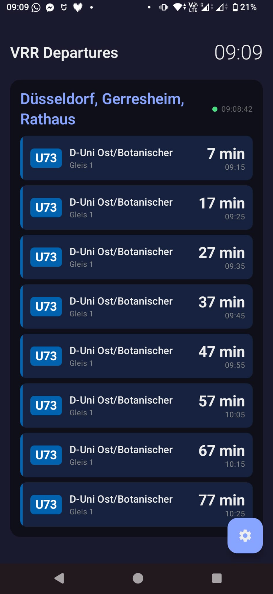
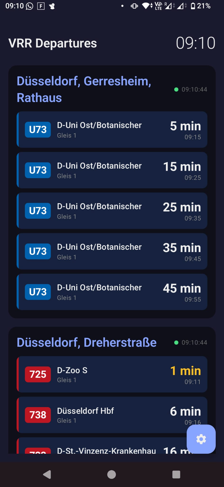
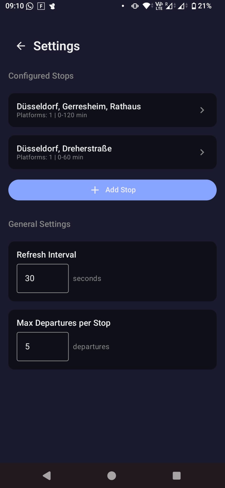
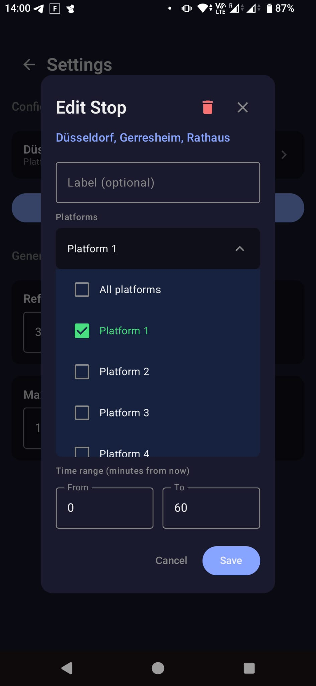

# VRR Departure Board - Android App

A real-time public transport departure board for the **VRR (Verkehrsverbund Rhein-Ruhr)** network in Germany. This Android app displays live departure times for U-Bahn, S-Bahn, trams, and buses across the Rhine-Ruhr metropolitan region.

This is the Android version of the [VRR Departure Board Web App](https://github.com/gulasz101/vrr-departure-board).

<p align="center">
  <a href="https://github.com/gulasz101/vrr-departure-android/releases/latest">
    
  </a>
</p>

## Screenshots

<p align="center">
  
  
  
  
</p>

## Features

- **Real-time departures** - Live departure times with delay information
- **Multiple stops** - Monitor several stops simultaneously
- **Platform filtering** - Select specific platforms to display
- **Time range filtering** - Show only departures within a specified time window
- **Auto-refresh** - Configurable automatic refresh interval
- **Dark theme** - Easy on the eyes, designed for quick glances
- **Offline configuration** - Your stop settings persist across app restarts

## Installation

### From GitHub Releases

1. Go to [Releases](https://github.com/gulasz101/vrr-departure-android/releases)
2. Download the latest `vrr-departure-board-vX.X.X.apk`
3. On your Android phone, enable "Install from unknown sources" in Settings
4. Open the downloaded APK to install

### Build from Source

```bash
# Clone the repository
git clone https://github.com/gulasz101/vrr-departure-android.git
cd vrr-departure-android

# Build debug APK
./gradlew assembleDebug

# Install on connected device/emulator
./gradlew installDebug
```

## VRR EFA API

This app uses the **VRR EFA (Elektronische Fahrplanauskunft)** API directly, without requiring a backend proxy. The EFA system is the standard electronic timetable information system used by many German public transport associations.

### API Base URL

```
https://efa.vrr.de/vrr/
```

### Endpoints Used

#### 1. Stop Search (`XSLT_STOPFINDER_REQUEST`)

Searches for stops/stations by name.

**Request:**
```
GET https://efa.vrr.de/vrr/XSLT_STOPFINDER_REQUEST
```

**Parameters:**
| Parameter | Value | Description |
|-----------|-------|-------------|
| `outputFormat` | `JSON` | Response format |
| `type_sf` | `any` | Search type (any location type) |
| `name_sf` | `{query}` | Search query (e.g., "Essen Hbf") |
| `coordOutputFormat` | `WGS84[DD.ddddd]` | Coordinate format |
| `locationServerActive` | `1` | Enable location server |
| `odvSugMacro` | `true` | Enable suggestions |

**Response Structure:**
```json
{
  "stopFinder": {
    "points": [
      {
        "name": "Essen Hauptbahnhof",
        "type": "stop",
        "stateless": "20009289",
        "anyType": "stop",
        "ref": {
          "place": "Essen",
          "coords": "7.014793,51.451355"
        }
      }
    ]
  }
}
```

**Note:** The `points` field can be either an array or an object with a nested `point` field, depending on the number of results.

#### 2. Departure Monitor (`XSLT_DM_REQUEST`)

Fetches real-time departures for a specific stop.

**Request:**
```
GET https://efa.vrr.de/vrr/XSLT_DM_REQUEST
```

**Parameters:**
| Parameter | Value | Description |
|-----------|-------|-------------|
| `outputFormat` | `JSON` | Response format |
| `language` | `de` | Language |
| `stateless` | `1` | Stateless request |
| `coordOutputFormat` | `WGS84[DD.ddddd]` | Coordinate format |
| `type_dm` | `any` | Location type |
| `name_dm` | `{stop_id}` | Stop ID (e.g., "20009289") |
| `itdDateDay` | `{day}` | Date - day |
| `itdDateMonth` | `{month}` | Date - month |
| `itdDateYear` | `{year}` | Date - year |
| `itdTimeHour` | `{hour}` | Time - hour |
| `itdTimeMinute` | `{minute}` | Time - minute |
| `mode` | `direct` | Direct departures only |
| `ptOptionsActive` | `1` | Enable PT options |
| `deleteAssignedStops_dm` | `1` | Don't include nearby stops |
| `useProxFootSearch` | `0` | Disable proximity search |
| `useRealtime` | `1` | Include real-time data |

**Response Structure:**
```json
{
  "departureList": [
    {
      "servingLine": {
        "number": "U11",
        "direction": "Essen Messe/Gruga",
        "motType": 2
      },
      "platform": "1",
      "dateTime": {
        "hour": "14",
        "minute": "30"
      },
      "realDateTime": {
        "hour": "14",
        "minute": "32"
      }
    }
  ]
}
```

### Transport Type Codes (`motType`)

| Code | Type | Example |
|------|------|---------|
| 0 | Regional Rail | RE, RB |
| 1 | S-Bahn | S1, S6 |
| 2 | U-Bahn | U11, U73 |
| 4, 5 | Tram/Straßenbahn | 101, 107 |
| 6, 7, 8 | Bus | 145, SB15 |

### API Quirks

1. **Content-Type Header**: The API returns JSON with `Content-Type: text/html` header instead of `application/json`. The app handles this by accepting multiple content types for JSON parsing.

2. **Variable Response Structure**: Some fields can be either arrays or single objects depending on the number of results (e.g., `points`, `departureList`).

3. **Real-time vs Scheduled**: The `dateTime` field contains scheduled times, while `realDateTime` (when present) contains actual/predicted times. Delays are calculated by comparing these values.

## Tech Stack

- **Language**: Kotlin
- **UI Framework**: Jetpack Compose with Material3
- **Architecture**: MVVM with Clean Architecture
- **Networking**: Ktor Client
- **JSON Parsing**: Kotlinx Serialization
- **Dependency Injection**: Hilt
- **Local Storage**: DataStore Preferences
- **Async**: Kotlin Coroutines & Flow

## Project Structure

```
app/src/main/java/com/vrr/departureboard/
├── data/
│   ├── api/           # Ktor API client & DTOs
│   ├── local/         # DataStore for settings
│   └── repository/    # Data repository
├── di/                # Hilt dependency injection
├── domain/
│   └── model/         # Domain models
└── ui/
    ├── components/    # Reusable UI components
    ├── screens/       # App screens (Departure, Settings)
    └── theme/         # Material3 theme (colors, typography)
```

## Requirements

- Android 8.0 (API 26) or higher
- Internet connection

## Related Projects

- [VRR Departure Board (Web)](https://github.com/gulasz101/vrr-departure-board) - The original web version of this app

## License

MIT License - feel free to use, modify, and distribute.

## Acknowledgments

- [VRR (Verkehrsverbund Rhein-Ruhr)](https://www.vrr.de/) for providing the public EFA API
- The EFA system developers for the comprehensive transit data API
